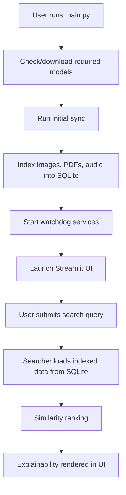

# Architecture Overview

This document describes the current system architecture of `content-search-ai` and explains how the application starts, indexes data, stores representations, and performs retrieval.

---

## 1. System Purpose

The project is a local multimodal retrieval system for digital multimedia archives. It supports semantic search across:
- images
- PDF documents
- audio files

The architecture combines:
- local file-based archives under `data/`
- model-based indexing pipelines
- SQLite storage for embeddings and metadata
- a Streamlit interface for search and explainability
- watchdog-based background monitoring for real-time archive updates

---

## 2. High-Level Flow

---

## 3. Startup Architecture

The application startup is orchestrated by `main.py`.

Current startup sequence:
1. create `Model()`
2. check whether required model files already exist locally
3. download model files only if they are missing
4. run `run_initial_sync()` to index existing archive files
5. start three background watchdog processes:
   - image watchdog
   - PDF watchdog
   - audio watchdog
6. launch the Streamlit application with the active Python environment
7. open the local Streamlit URL in the browser

Key startup responsibilities:
- `main.py`
- `core/model.py`
- `core/watchdog/sync_manager.py`

---

## 4. Data Sources and Runtime Folders

Primary archive folders:
- `data/images`
- `data/pdfs`
- `data/audio`

Runtime query/upload folders:
- `data/query`
- `data/query_images`

These folders act as the filesystem layer of the application. Indexed representations are then persisted in SQLite.

---

## 5. Database Architecture

The database layer is implemented in `core/db/database_helper.py`.

Main database file:
- `content_search_ai.db`

Main tables:
- `images`
  - image metadata
  - relative file path
  - image embedding
- `pdf_pages`
  - PDF path
  - page number
  - extracted page text
  - page embedding
- `audio_embeddings`
  - audio path
  - transcript embedding
- `audio_emotions`
  - audio path
  - predicted emotion
  - emotion probabilities
- `search_logs`
  - stored search history
- `watchdog_status`
  - status of image/pdf/audio indexing services

Database design notes:
- SQLite is used as the unified persistence layer
- embeddings are stored as binary blobs
- runtime search reads directly from the database
- watchdog state is also stored in the same database

---

## 6. Indexing Architecture

### 6.1 Initial Sync

The initial sync is implemented in `core/watchdog/sync_manager.py`.

When the app starts, the sync manager:
- scans the archive folders
- compares filesystem contents with the database
- inserts missing items into the database
- removes stale database entries for deleted files

This creates a consistent baseline before the watchdog services begin monitoring new changes.

### 6.2 Image Indexing

Image indexing pipeline:
1. read image from `data/images`
2. preprocess image with CLIP preprocessing
3. encode image with CLIP image encoder
4. normalize embedding
5. store embedding in `images`

Main modules:
- `core/image_search.py`
- `core/watchdog/sync_manager.py`
- `core/watchdog/watch_images_other.py`

### 6.3 PDF Indexing

PDF indexing pipeline:
1. open PDF with PyMuPDF
2. extract text page by page
3. discard weak/low-text pages
4. encode valid pages with M-CLIP sentence transformer
5. store page text and page embedding in `pdf_pages`

Main modules:
- `core/pdf_search.py`
- `core/watchdog/sync_manager.py`
- `core/watchdog/watch_pdfs.py`

### 6.4 Audio Indexing

Audio indexing pipeline:
1. read audio file from `data/audio`
2. transcribe audio with Faster-Whisper
3. encode transcript with M-CLIP
4. classify emotion with `EmotionModelV5`
5. store transcript embedding in `audio_embeddings`
6. store emotion metadata in `audio_emotions`

Main modules:
- `core/audio_search.py`
- `core/emotion_model_v5.py`
- `core/watchdog/sync_manager.py`
- `core/watchdog/watch_audio_other.py`

Important note:
- audio retrieval is transcript-based semantic retrieval with emotion metadata
- it is not direct raw-audio embedding retrieval

---

## 7. Search Architecture

### 7.1 Text -> Image

Implemented in `core/image_search.py`.

Flow:
1. detect query language
2. normalize some Greek query terms into shared English concepts
3. build prompt variants
4. encode query prompts with M-CLIP
5. load image embeddings from SQLite
6. compute cosine similarity
7. apply adaptive threshold
8. return top-ranked results

### 7.2 Image -> Image

Implemented in `core/image_search.py`.

Flow:
1. preprocess uploaded query image
2. encode query image with CLIP image encoder
3. load stored image embeddings from SQLite
4. compute cosine similarity
5. apply adaptive threshold
6. return top-ranked visually similar images

### 7.3 Text -> PDF

Implemented in `core/pdf_search.py`.

Flow:
1. encode query text with M-CLIP
2. load stored PDF page embeddings from SQLite
3. compute page-level semantic similarity
4. apply adaptive threshold
5. compute paragraph-level supporting evidence for matched pages
6. return top-ranked page results

### 7.4 PDF -> PDF

Implemented in `core/pdf_search.py`.

Flow:
1. extract and encode pages of the uploaded query PDF
2. aggregate query page embeddings into a document-level vector
3. group stored pages by PDF document
4. build document-level vectors for stored PDFs
5. rank documents by semantic similarity
6. inspect matching pages and paragraphs for explainability
7. return top-ranked document/page results

### 7.5 Text/Emotion -> Audio

Implemented in `core/audio_search.py`.

Flow for semantic search:
1. encode query text with M-CLIP
2. load transcript embeddings from SQLite
3. compute cosine similarity
4. apply adaptive threshold
5. return top-ranked audio items with emotion metadata

Flow for emotion search:
1. normalize emotion query
2. load audio emotion metadata from SQLite
3. filter by predicted emotion
4. return matching items

---

## 8. Explainability Layer

Explainability is intentionally separated from retrieval ranking.

The UI explainability layer provides:
- computational summaries
- numerical top-k tables
- confidence-style indicators
- evidence snippets or metadata

Per modality:
- images
  - similarity score
  - confidence indicator
- PDFs
  - similarity score
  - page number
  - most similar paragraph
- audio
  - similarity score
  - dominant emotion
  - emotion probabilities

Design principle:
- explainability improves transparency
- explainability does not change ranking logic

---

## 9. Watchdog Architecture

The system includes three watchdog services:
- `watch_images_other.py`
- `watch_pdfs.py`
- `watch_audio_other.py`

Responsibilities:
- monitor archive folders for file creation, modification, and deletion
- update the SQLite database when files change
- keep indexed content synchronized with the filesystem after startup

Watchdog runtime state is recorded in the `watchdog_status` table and surfaced in the dashboard UI.

---

## 10. UI Architecture

The user interface is implemented with Streamlit.

Current structure:
- `app.py`
  - lightweight app entry shell
  - global configuration
  - database/searcher initialization
  - tab orchestration
- `ui/`
  - shared styles
  - app header
  - dashboard
  - tab-specific view modules

This refactor reduces the size of `app.py` and improves maintainability by separating view responsibilities into focused modules.

---

## 11. Current Architectural Strengths

- unified local database for all indexed modalities
- clear separation between indexing and search
- real-time synchronization with archive folders
- multimodal retrieval inside one application
- explainability layer separated from ranking
- cleaner Streamlit UI structure after refactor

---

## 12. Current Limitations

- model assets are distributed externally and downloaded if missing
- retrieval thresholds are heuristic rather than experimentally calibrated
- SQLite works well for the current scale but is not optimized for large-scale vector search
- watchdog services may duplicate heavy model loading across processes
- some model duplication is an intentional trade-off of the current process-isolated design:
  - initial sync loads its own indexing models
  - watchdog services load their own long-lived model instances
  - runtime UI searchers load their own search-time model instances
- this increases memory usage, but keeps the architecture simpler and safer than introducing shared cross-process model serving at the current project scale
- no full automated test suite yet

---

## 13. Possible Future Architecture Improvements

- introduce architecture diagrams in thesis presentation material
- add migration/versioning strategy for the database schema
- move toward larger-scale vector indexing when needed
- reduce repeated heavy model loading across background services
- add evaluation and testing layers around the retrieval system

